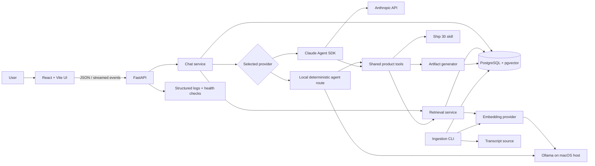
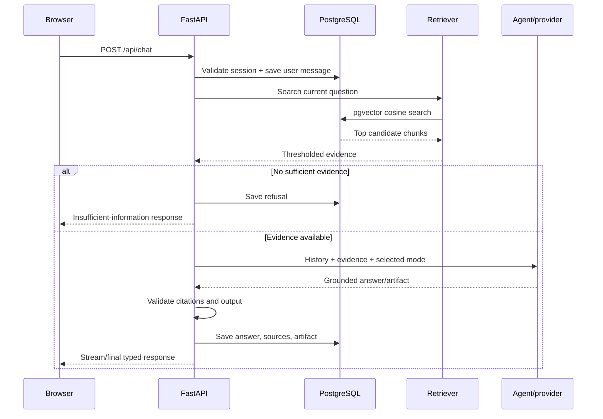

# Architecture: The Lenny Growth Assistant

## 1. Architecture goals

The system must be grounded, understandable, locally demonstrable, secure enough to render untrusted generated content, and simple for an evaluator to operate. Boundaries are explicit so retrieval, model providers, agent tools, persistence, and UI rendering can be tested independently.

## 2. System overview



## 3. Deployment topology

Docker Compose runs three services:

- `db`: PostgreSQL with the pgvector extension.
- `backend`: FastAPI/uvicorn, connected to `db` and to host Ollama at `http://host.docker.internal:11434`.
- `frontend`: production-built React application served by a small web server and configured to call the backend.

Ollama runs directly on macOS. During non-Docker development the backend uses `http://localhost:11434`. Cloud requests leave the machine only when the user explicitly selects Anthropic.

## 4. Component boundaries

### Frontend

The frontend owns presentation state, selected provider, streaming display, source cards, and safe artifact preview. It never connects directly to PostgreSQL, Ollama, or Anthropic and never receives secret keys.

### FastAPI API

The API owns validation, request IDs, authentication-ready boundaries, status codes, exception mapping, and streaming protocol. Route handlers remain thin and call services.

### Chat service

The chat service loads the session, stores the user message, retrieves session history, routes the request, validates citations/artifacts, stores the result, and returns a typed response. A database transaction prevents partial persistence where practical.

### Retrieval service

Retrieval embeds the current question, performs cosine-distance search, applies a relevance threshold, and returns typed chunks. It does not generate prose.

### Provider layer

`BaseLLMProvider` exposes a provider-neutral asynchronous generation contract. `OllamaProvider` and `AnthropicProvider` translate that contract to their transports. The provider factory accepts only an allowlisted provider name.

### Agent layer

The Anthropic cloud route uses the official Claude Agent SDK and an allowlist of in-process custom tools. It does not receive filesystem, shell, network-search, or code-execution tools.

The local Ollama route uses deterministic application routing: retrieval always runs before generation, and a requested mode selects the Ship 30 or artifact service. This is intentional because small local models are less dependable tool selectors. The same typed tool functions are used by both paths, so behavior remains testable and consistent.

Allowed product tools:

- `search_transcripts(query, top_k)` returns evidence records.
- `generate_ship30_essay(question, evidence)` returns grounded Markdown.
- `create_markdown_artifact(instructions, evidence, conversation)` returns a typed artifact draft.
- `create_html_artifact(instructions, evidence, conversation)` returns a typed HTML artifact draft.

## 5. Request and retrieval flow



Follow-up questions include a bounded window of messages from the same session. Retrieval still uses the current question, optionally rewritten using that history. No messages from another session are visible.

## 6. Ingestion architecture

1. The downloader obtains transcript files and records a source URL and source revision when available.
2. The parser normalizes text and extracts episode title, guest, date, timestamp/section, and source metadata.
3. The chunker targets about 650 tokens with 100-token overlap and preserves section/timestamp boundaries when possible.
4. The embedding client batches chunks through `nomic-embed-text`.
5. The loader upserts episodes/chunks using a deterministic content hash, making reruns safe.
6. Deleted or changed source material is reconciled only within the selected source revision, avoiding accidental deletion of unrelated rows.

Each chunk stores its embedding model and content hash. The embedding dimension will be discovered and then fixed in the schema; ingestion fails clearly if a model returns a different dimension.

## 7. Database schema

### `sessions`

- `id UUID PRIMARY KEY`
- `title TEXT NOT NULL`
- `user_metadata JSONB NOT NULL DEFAULT '{}'`
- `created_at TIMESTAMPTZ NOT NULL`
- `updated_at TIMESTAMPTZ NOT NULL`

### `messages`

- `id UUID PRIMARY KEY`
- `session_id UUID NOT NULL REFERENCES sessions(id) ON DELETE CASCADE`
- `role TEXT NOT NULL CHECK (role IN ('user','assistant'))`
- `content TEXT NOT NULL`
- `provider TEXT NULL`
- `mode TEXT NULL`
- `sources JSONB NOT NULL DEFAULT '[]'`
- `created_at TIMESTAMPTZ NOT NULL`
- Index on `(session_id, created_at)`.

### `artifacts`

- `id UUID PRIMARY KEY`
- `message_id UUID NOT NULL REFERENCES messages(id) ON DELETE CASCADE`
- `artifact_type TEXT NOT NULL CHECK (artifact_type IN ('markdown','html'))`
- `title TEXT NOT NULL`
- `content TEXT NOT NULL`
- `created_at TIMESTAMPTZ NOT NULL`

### `transcript_chunks`

- `id UUID PRIMARY KEY`
- `episode_title TEXT NOT NULL`
- `guest_name TEXT NULL`
- `publication_date DATE NULL`
- `timestamp_ref TEXT NULL`
- `source_url TEXT NOT NULL`
- `source_revision TEXT NULL`
- `chunk_index INTEGER NOT NULL`
- `chunk_text TEXT NOT NULL`
- `content_hash TEXT NOT NULL UNIQUE`
- `embedding_model TEXT NOT NULL`
- `embedding VECTOR(<verified dimension>) NOT NULL`
- `created_at TIMESTAMPTZ NOT NULL`
- Cosine HNSW index on `embedding` after dimension verification.

## 8. API contracts

Initial endpoints:

- `POST /api/sessions` creates a session and returns `201`.
- `GET /api/sessions` lists recent sessions.
- `GET /api/sessions/{session_id}` returns session metadata, messages, sources, and artifacts or `404`.
- `POST /api/chat` accepts `session_id`, `message`, `provider`, and `mode`; it returns or streams a typed assistant result.
- `GET /api/artifacts/{artifact_id}` returns one artifact or `404`.
- `GET /api/health` returns component statuses. A degraded dependency is visible separately from API liveness.

Errors use a stable envelope:

```json
{
  "error": {
    "code": "OLLAMA_UNAVAILABLE",
    "message": "The local model is not available.",
    "request_id": "...",
    "details": {}
  }
}
```

## 9. Provider switching

The frontend sends an allowlisted provider on each chat request. The server records the selected provider with the assistant message. There is no silent fallback because that could unexpectedly send local-only content to a cloud service. If a provider fails, the user sees a specific retry/change-provider action.

## 10. Artifact security

Generated HTML is untrusted even when created by our model.

The backend validates type and size but does not claim to make HTML safe. The frontend sanitizes HTML with DOMPurify, removes scripts, event-handler attributes, dangerous URL schemes, embedded objects, forms, and remote-resource elements unless explicitly allowlisted. It then places the sanitized document in an iframe using `srcdoc`.

The iframe omits `allow-same-origin`, navigation, forms, popups, downloads, and parent access. Scripts are blocked by default; we do not need `allow-scripts` for the assessment's HTML/CSS artifacts. A restrictive Content Security Policy in `srcdoc` blocks network connections, framing, plugins, and external resources. This provides defense in depth: sanitization reduces dangerous markup, while the cross-origin sandbox contains anything missed.

Markdown rendering does not enable raw HTML. Links receive safe protocols and `rel="noopener noreferrer"` when opened externally.

## 11. Observability

JSON logs contain timestamp, level, event name, request ID, session ID where safe, provider, mode, latency, retrieved count, and error code. Logs never contain API keys, full transcript chunks, or full user/assistant content by default.

Tracked events include API requests, retrieval, provider selection, model latency/failures, database errors, ingestion counts, and artifact validation. Health checks have short timeouts and do not invoke costly model generation.

## 12. Failure handling

- Missing environment configuration fails startup with a clear field-level message when required for the enabled feature.
- Missing Anthropic key disables cloud readiness but not local startup.
- Ollama unavailability returns `503` for a local chat and marks its health component unavailable.
- Database failure marks readiness unhealthy and returns `503` for dependent endpoints.
- Empty/weak retrieval returns a grounded refusal, not a server error.
- Model timeouts return `504` with a retry-safe error.
- Invalid requests return FastAPI/Pydantic `422` responses mapped to the stable error shape.
- Unsafe or oversized artifacts are rejected before persistence/preview.

## 13. Testing strategy

Unit tests cover chunking, thresholds, provider selection, tool inputs, sanitization helpers, and schemas. Integration tests cover database persistence, pgvector retrieval, API errors, session isolation, and health status. Provider transports are mocked except for explicitly marked local smoke tests. A manual checklist covers streaming, responsiveness, keyboard navigation, citations, and artifact isolation.

