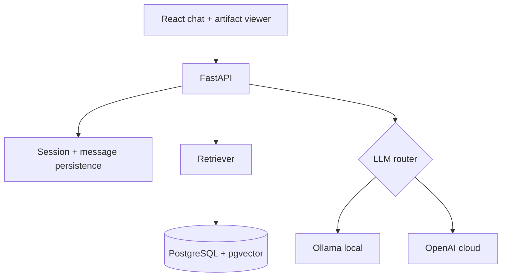

# Architecture

## Contracts

`POST /api/chat` accepts `{session_id, message, provider?, mode}`. It returns `{answer, sources, provider, mode}`. `sources` always contains title, guest, timestamp, and URL when retrieval succeeds. Input is Pydantic-validated; missing sessions return 404 and provider failures return a grounded fallback.

## Ingestion and retrieval

The production path downloads Markdown transcripts, preserves title/guest/date/timestamp metadata, splits content into 500–800-token windows with 100-token overlap, embeds it, and stores vectors alongside chunk metadata. PostgreSQL has the pgvector image and should use an HNSW cosine index. The submitted demo uses an explicit small fixture and lexical scoring so it can run offline; its repository boundary is deliberately isolated in `app/rag/retriever.py`, making the pgvector replacement local.

## Security and observability

The model receives retrieved snippets only. Answers must cite the source label provided in context. API failures use structured logs containing an event and safe error text. Generated HTML is untrusted: DOMPurify removes dangerous elements/attributes and an iframe sandbox does not receive same-origin access.
